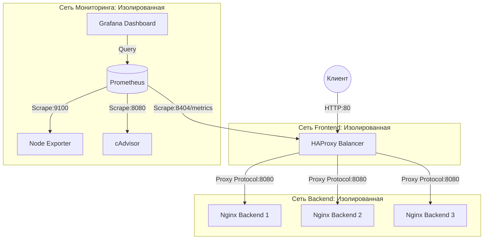

# Курсовой проект по администрированию ОС Linux
## Тема №2: «Настройка балансировщика нагрузки HAProxy»

Репозиторий содержит законченную инфраструктуру (IaC) для развертывания отказоустойчивого веб-сервиса на базе балансировщика нагрузки HAProxy и трех бэкенд-серверов Nginx. В проект также интегрирован стек мониторинга на базе Prometheus, Grafana, Node Exporter и cAdvisor, а также автоматизированные Chaos Engineering сценарии для проверки отказоустойчивости.

---

## Архитектура системы

Балансировка организована с использованием изолированных bridge-сетей Docker. Внешний трафик попадает на HAProxy, который распределяет его по 3 бэкендам Nginx.



### Основные технические особенности:
1. **Безопасность (Hardening)**: 
   - Все контейнеры запускаются от непилегированных пользователей (`USER haproxy` и `USER nginx`).
   - Контейнеры бэкендов работают в режиме read-only файловой системы (`read_only: true`) с монтированием `tmpfs` под временные файлы и логи.
   - Использование ядерных настроек sysctl для защиты от сетевых атак (SYN Flood, IP-spoofing).
2. **Маршрутизация и IP**: Передача реального IP клиента осуществляется через Proxy Protocol v2 и заголовок `X-Forwarded-For`.
3. **Sticky Sessions**: Поддержка липких сессий на основе cookie-файлов (`SERVERID`).
4. **Наблюдаемость (Observability)**: Сквозной сбор метрик с визуализацией в Grafana в режиме полного IaC (автоимпорт источников данных и дашбордов при старте).
5. **Chaos Engineering**: Набор автотестов для симуляции выхода из строя до 2 серверов бэкенда с замером времени переключения и валидацией бесперебойной работы.

---

## Структура каталогов

```text
project-root/
├── .github/
│   ├── workflows/             # GitHub Actions Pipelines
│   └── linters/               # Конфигурации для линтеров (Hadolint, ShellCheck, etc.)
├── config/
│   ├── haproxy/
│   │   └── haproxy.conf       # Настройки балансировщика
│   ├── nginx/
│   │   └── nginx.conf         # Настройки бэкендов Nginx
│   ├── sysctl.d/
│   │   └── 99-hardening.conf  # Настройки безопасности ядра Linux
│   ├── prometheus/
│   │   └── prometheus.yml     # Сбор метрик Prometheus
│   └── grafana/
│       ├── provisioning/      # Автоимпорт Grafana
│       └── dashboards/        # Дашборд HAProxy
├── deploy/
│   ├── docker-compose.yml     # Конфигурация оркестрации сервисов
│   ├── haproxy/
│   │   └── Dockerfile         # Непривилегированный контейнер HAProxy
│   ├── nginx/
│   │   └── Dockerfile         # Непривилегированный контейнер Nginx
│   └── scripts/
│       ├── bootstrap.sh       # Первичная настройка ОС и установка Docker
│       └── tests/
│           └── test_integration.py # Интеграционные тесты и Chaos сценарии
```

---

## Быстрый старт

### Шаг 1: Подготовка ОС (через bootstrap.sh)
Скрипт проверяет ОС, накатывает патчи безопасности sysctl и устанавливает Docker:
```bash
sudo chmod +x deploy/scripts/bootstrap.sh
sudo ./deploy/scripts/bootstrap.sh
```

### Шаг 2: Создание секретов и запуск
Создайте секреты для авторизации панели статистики HAProxy:
```bash
mkdir -p deploy/secrets
echo "admin" > deploy/secrets/stats_user.txt
echo "SuperSecurePassword123" > deploy/secrets/stats_password.txt
```

Создайте файл `.env` из шаблона:
```bash
cp .env.example .env
```

Запустите контейнеры:
```bash
docker compose -f deploy/docker-compose.yml up -d
```

Проверьте доступность:
- Веб-сервис: [http://localhost](http://localhost)
- Панель статистики HAProxy: [http://localhost:8404/stats](http://localhost:8404/stats) (пользователь/пароль из секретов)
- Grafana: [http://localhost:3000](http://localhost:3000) (admin / admin_secret_change_me)

---

## Тестирование и Chaos Engineering

Автоматические тесты написаны на Python и требуют библиотеки `requests` и `pytest`. Тесты проверяют балансировку Round Robin, Sticky Sessions и отказоустойчивость при остановке контейнеров.

### Запуск тестов:
```bash
# Активация виртуального окружения (создается автоматически при bootstrap.sh)
source deploy/scripts/tests/venv/bin/activate

# Переход в каталог тестов и запуск
cd deploy/scripts/tests/
pytest -v test_integration.py
```
> **Сценарий отказа**: Тест останавливает контейнеры бэкендов (`docker compose stop nginx1 nginx2`) и проверяет, что HAProxy мгновенно перенаправляет трафик на живой бэкенд, время ответа клиента при этом остается стабильным, а код ответа равен HTTP 200.
